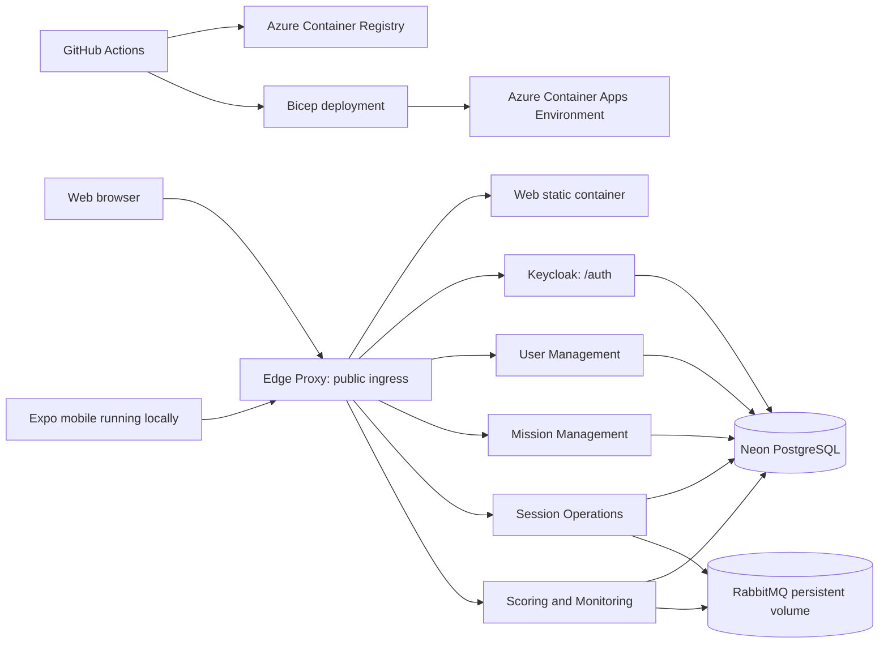

# Infrastructure for the Azure Container Apps demo

The deployment keeps the project topology intact while minimizing the public attack surface.
The browser and the local Expo client use one public base URL. The Edge Proxy routes `/auth`
to Keycloak and all API paths to their bounded-context services.

## URL and token contract

`DEMO_PUBLIC_BASE_URL` has no trailing slash. The authentication issuer is always
`${DEMO_PUBLIC_BASE_URL}/auth/realms/umbral`; services must not validate against an internal
container hostname. Keycloak is configured with the same public hostname and receives browser
traffic through the proxy.

## Ingress

| Component | Ingress | Reason |
| --- | --- | --- |
| Edge Proxy | External | Single browser and mobile entry point |
| Web | Internal HTTP | Served through Edge Proxy fallback |
| Keycloak | Internal HTTP | Browser-visible as `/auth` through Edge Proxy |
| Business services | Internal HTTP | API paths are routed through Edge Proxy |
| Neon PostgreSQL | External TLS | Managed demo persistence; no public Azure ingress |
| RabbitMQ | Internal TCP | Demo messaging only |

## Bicep deployment shape

`deployment/azure/main.bicep` is intentionally resource-group scoped. The deployment workflow
creates the resource group first, then runs the template in two phases:

1. `deployContainerApps=false`: create Log Analytics, Container Apps Environment, ACR,
   storage account, file shares, and Container Apps environment storage links.
2. `deployContainerApps=true`: create or update RabbitMQ, Keycloak, Web, Edge
   Proxy, and the four bounded-context services using immutable SHA-tagged images.

Neon hosts PostgreSQL. RabbitMQ mounts an Azure Files share for the short-lived academic demo;
this preserves messaging state across restarts for the defense without adding Kubernetes or a
managed Azure database.
